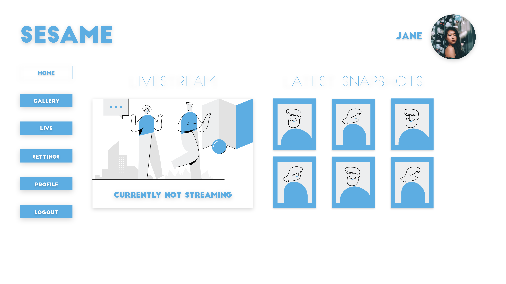

<!-- Project Logo -->
# SESAME
**ITP - Projekt 
Klasse:** 4BHITM 
**Jahr:** 2020/2021 
**Projektleiter:** Koll Simon 
**Team:** Danninger Julian, Golic Benjamin, Meisinger Sean-Patrick
 

 
<!-- Table of Contents -->
## Inhalt
* [Beschreibung](#toc_2)
* [Technologien](#toc_2)

<!-- Description -->
## Beschreibung
Die Nachfrage für Türsysteme mit Überwachung wird immer größer. Die Sicherheit ist in Tagen wie diesen etwas, was für alle Menschen wichtig ist. Wir wollen einen Beitrag dazu leisten, die Sicherheit zu erhöhen. Um die Tür zu öffnen, müssen die Gesichtserkennung und der Fingerabdruck positiv sein. Bei einem Versagen der Hardware kann ein gewöhnlicher Schlüssel verwendet werden. Sobald sich jemand der Tür nähert, wird ein Livestream gestartet und eine Benachrichtigung an den Besitzer gesendet. Falls die Kamera das Gesicht nicht erkennt, wird ein Foto gemacht und in einer Galerie gespeichert, um nachvollziehen zu können, wer in den privaten Bereich eindringen wollte. 

## Technologien
* HTML
* CSS
* Javascript
* [NodeJS](nodejs.org/)
* [Python](https://www.python.org)
* [Docker](https://www.docker.com)
* [MQTT](https://mqtt.org)
* [OpenCV](https://opencv.org)
* [Ionic](https://ionicframework.com)
* [Keycloak](https://www.keycloak.org)
